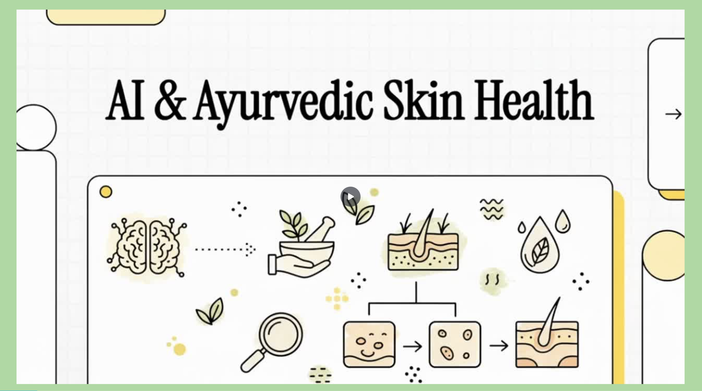
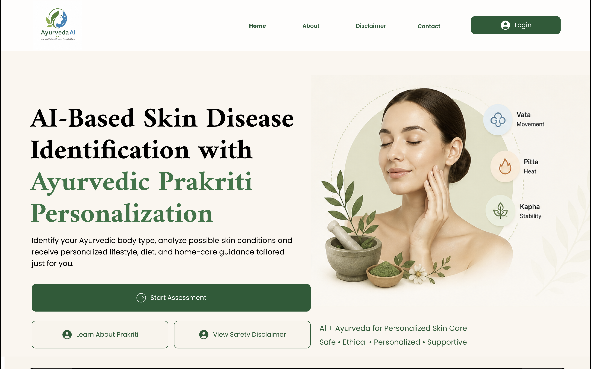
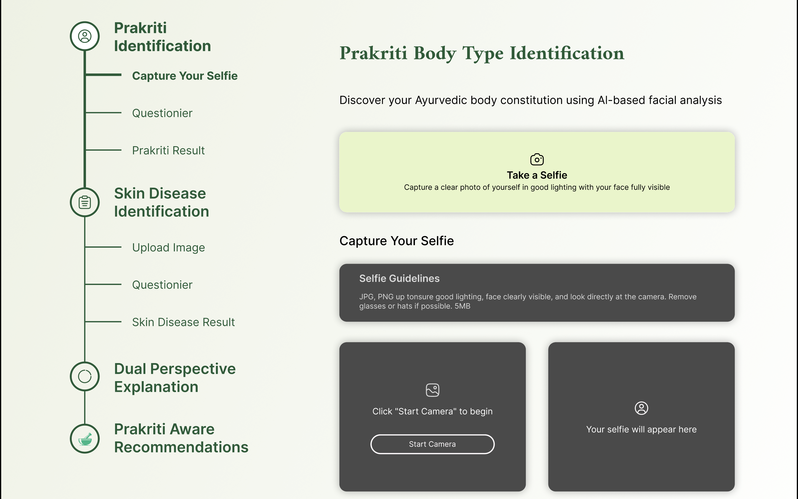
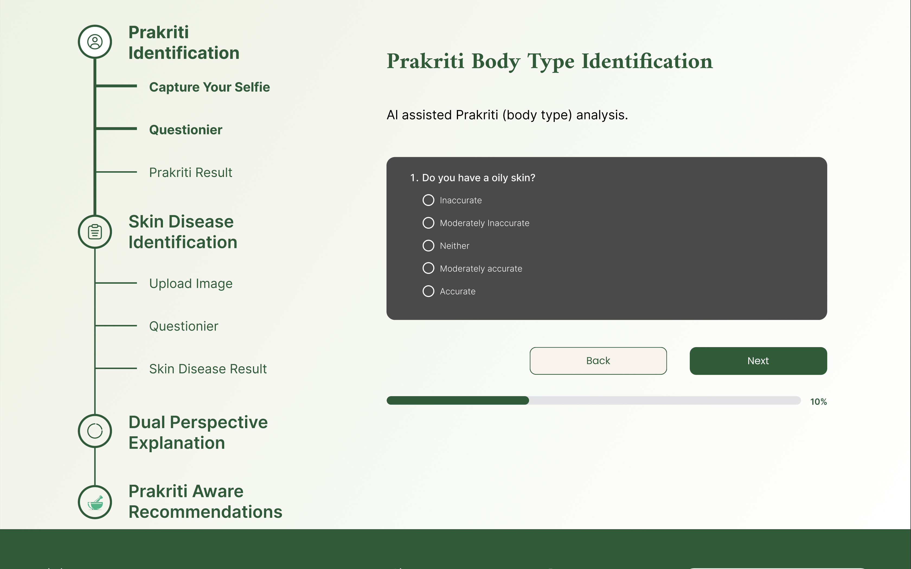
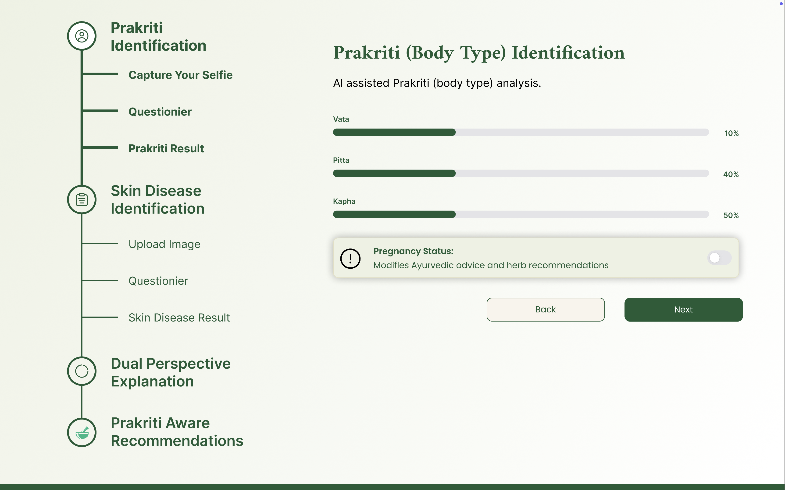
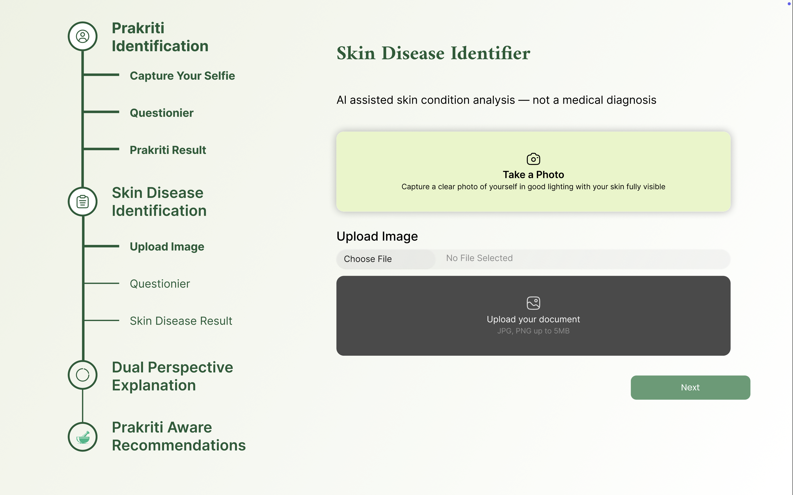
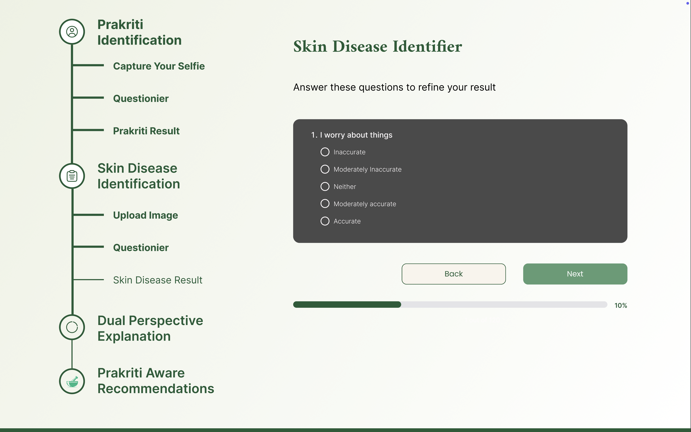
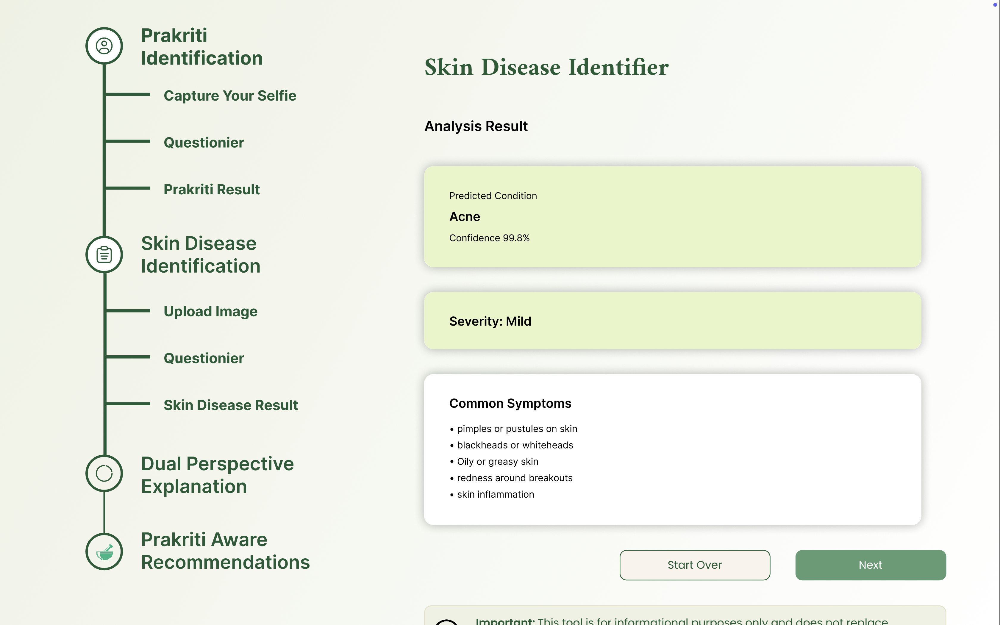
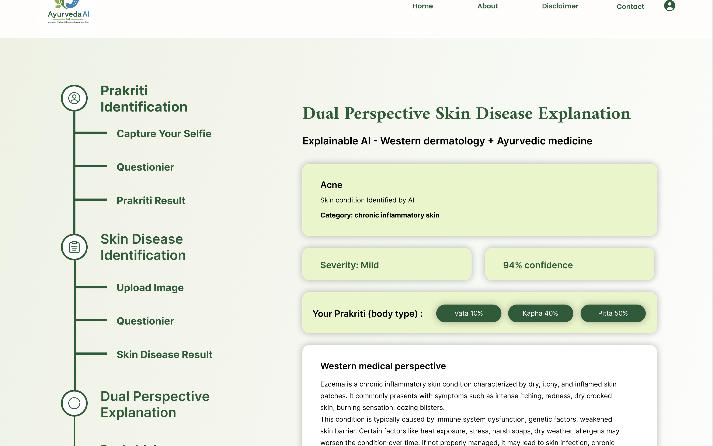
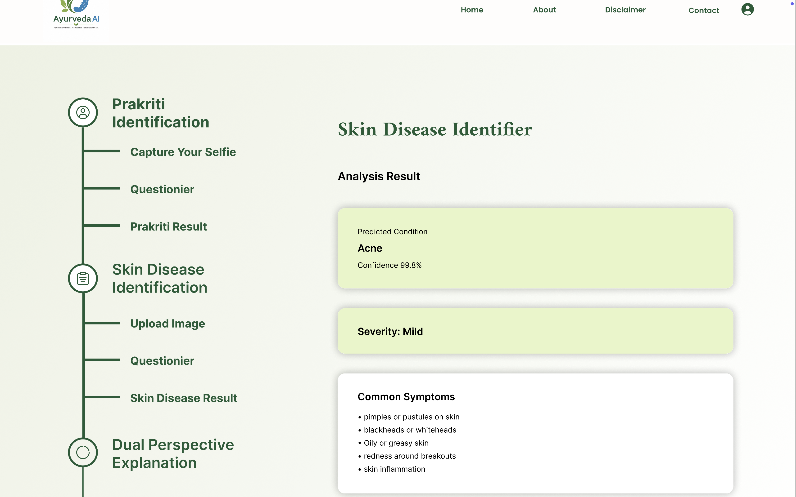

# AI-Based Skin Disease Identification with Ayurvedic Prakriti Personalization

> An AI-powered web application that integrates **Computer Vision**, **Machine Learning**, and **Ayurvedic Prakriti Analysis** to provide personalized skin disease identification, dual-perspective explanations, and lifestyle recommendations.

## Project Demonstration

<p align="center">
  <a href="https://mysliit-my.sharepoint.com/:v:/g/personal/it22081384_my_sliit_lk/IQCdXOoakZgJSLY7C_PbMSrJAaiYWBZqq8F8WXsKXjykH64?e=fhXqYf" target="_blank">
    
  </a>
</p>

<p align="center">
  <strong>Figure 1.</strong> Click the image above to watch the complete project demonstration.
</p>

<p align="center">
<!--


-->


</p>

---

## Table of Contents

- [Overview](#overview)
- [Research Objectives](#research-objectives)
- [Key Features](#key-features)
- [System Workflow](#system-workflow)
- [Application Workflow](#application-workflow)
- [Technology Stack](#technology-stack)
- [Project Structure](#project-structure)
- [Getting Started](#getting-started)
- [Team Members](#team-members)
- [Research Contributions](#research-contributions)
- [Future Enhancements](#future-enhancements)
- [License](#license)
- [Acknowledgements](#acknowledgements)

---

# Overview

This project was developed as the **Final Year Research Project** for the **Bachelor of Science (Hons) in Information Technology** at the **Sri Lanka Institute of Information Technology (SLIIT)**.

Unlike conventional skin disease classification systems, this platform combines **Artificial Intelligence** with **Ayurvedic healthcare principles** to provide a more personalized healthcare decision-support experience.

The system is capable of:

-  Detecting skin diseases using Deep Learning
-  Identifying the user's Ayurvedic **Prakriti (Body Constitution)**
-  Collecting additional symptoms through an adaptive questionnaire
-  Providing explanations from both Western Medical and Ayurvedic perspectives
-  Generating personalized lifestyle and dietary recommendations

> **Disclaimer**
>
> This application is intended **solely for research and educational purposes** and should **not** be considered a replacement for professional medical diagnosis or treatment.

---

#  Research Objectives

The primary objective of this research is to design and implement an intelligent healthcare decision-support system capable of integrating:

- AI-based Skin Disease Identification
- Ayurvedic Prakriti Identification
- Explainable Artificial Intelligence (XAI)
- Adaptive Symptom Assessment
- Personalized Recommendation Generation

The goal is to improve user understanding while promoting responsible and explainable AI within healthcare.

---

#  Key Features

##  AI Skin Disease Detection

- Upload an image of the affected skin area
- Deep Learning prediction using Transfer Learning
- Confidence score for each prediction

---

##  Face Detection

- Detects and validates facial images
- Ensures image quality before processing
- Extracts facial features for Prakriti analysis

---

##  Ayurvedic Prakriti Identification

The system predicts the user's body constitution:

- Vata
- Pitta
- Kapha
- Mixed Prakriti Types

Prediction is based on:

- Facial characteristics
- User questionnaire
- Machine Learning model

---

##  Adaptive Symptom Questionnaire

Instead of asking every possible question, the application dynamically generates questions based on previous responses.

Benefits include:

- Reduced user effort
- Improved prediction confidence
- Personalized interaction

---

##  Explainable Results

Each prediction includes explanations from two perspectives.

### Western Medical Perspective

- Disease overview
- Common symptoms
- Possible causes
- General treatment information

### Ayurvedic Perspective

- Dosha imbalance
- Traditional interpretation
- Ayurvedic understanding of the condition

---

##  Personalized Recommendations

Recommendations are generated by combining:

- Predicted Skin Disease
- Identified Prakriti

The recommendation engine provides:

-  Dietary suggestions
-  Lifestyle guidance
-  Wellness recommendations
-  Foods to avoid
-  Home care advice

---

#  System Workflow

```text
          User
            │
            ▼
     Upload Face Image
            │
            ▼
     Face Detection
            │
            ▼
  Prakriti Identification
            │
            ▼
 Upload Skin Disease Image
            │
            ▼
 Skin Disease Prediction
            │
            ▼
 Adaptive Questionnaire
            │
            ▼
  Dual Perspective Explanation
            │
            ▼
 Personalized Recommendations
```

---

# Application Workflow

The following screenshots illustrate the complete workflow of the proposed AI-based decision-support system.

---

## Step 01 — Home Page

The landing page introduces the application and provides access to the AI-assisted assessment workflow.

<p align="center">

</p>

---

## Step 02 — Prakriti Identification

The user captures a facial image for AI-assisted Prakriti prediction.

<p align="center">

</p>

---

## Step 03 — Prakriti Questionnaire

The adaptive questionnaire refines the body constitution prediction.

<p align="center">

</p>

---

## Step 04 — Prakriti Result

The system predicts the user's Ayurvedic body constitution.

<p align="center">

</p>

---

## Step 05 — Skin Image Upload

The user uploads an image of the affected skin region.

<p align="center">

</p>

---

## Step 06 — Adaptive Symptom Questionnaire

Additional questions are generated dynamically to improve prediction confidence.

<p align="center">

</p>

---

## Step 07 — Skin Disease Prediction

The deep learning model predicts the skin disease together with confidence and severity.

<p align="center">

</p>

---

## Step 08 — Dual Perspective Explanation

The predicted disease is explained from both Western medical and Ayurvedic perspectives.

<p align="center">

</p>

---

## Step 09 — Personalized Recommendations

The recommendation engine generates personalized lifestyle and dietary guidance.

<p align="center">

</p>

---

# Technology Stack

| Layer | Technologies |
|--------|--------------|
| Frontend | React.js, HTML5, CSS3, JavaScript |
| Backend | FastAPI, Python |
| Machine Learning | TensorFlow, Keras, MobileNetV2, OpenCV, NumPy, Scikit-learn |
| Database | MongoDB |
| Development Tools | Git, GitHub, Visual Studio Code, Google Colab, Postman |

---

#  Project Structure

```text
project-root/
│
├── backend/
│   ├── api/
│   ├── models/
│   ├── services/
│   ├── utils/
│   └── main.py
│
├── frontend/
│   ├── public/
│   ├── src/
│   └── package.json
│
├── model/
│   ├── skin_model.h5
│   └── class_labels.json
│
├── dataset/
│
├── screenshots/
│
├── requirements.txt
│
└── README.md
```

---

#  Getting Started

## Clone Repository

```bash
git clone https://github.com/your-username/your-repository.git

cd your-repository
```

---

# ⚙ Backend Setup

Create a virtual environment.

```bash
python -m venv venv
```

Activate it.

### Windows

```bash
venv\Scripts\activate
```

### macOS/Linux

```bash
source venv/bin/activate
```

Install required packages.

```bash
pip install -r requirements.txt
```

Run the API.

```bash
uvicorn main:app --reload
```

---

#  Frontend Setup

Navigate to the frontend directory.

```bash
cd frontend
```

Install dependencies.

```bash
npm install
```

Start the React application.

```bash
npm start
```

---

#  Team Members

| Name | Student ID | Research Component |
|------|------------|--------------------|
| Hussainiya M.H.F | IT22643636 | Prakriti Identification |
| Shenali Kumarathunga | IT22114976 | Adaptive Skin Disease Identification |
| W.D.M. Methsiluni | IT22161024 | Dual Perspective Explanation |
| H.P.W.N. Herath | IT22081384 | Personalized Recommendation Module |

---

#  Research Contributions

Each researcher independently designed and implemented a dedicated research component.

The final system integrates these modules into a unified AI-driven healthcare decision-support platform.

---

#  Future Enhancements

- Mobile Application
- Additional Skin Disease Classes
- Clinical Validation
- Explainable AI Dashboard
- Multi-language Support
- Cloud Deployment
- Electronic Medical Record Integration

---

#  License

This repository is published for **academic and research purposes only**.

Please contact the authors before using any part of this work in commercial products.

---

#  Acknowledgements

We sincerely thank:

- Our project supervisors
- The external Ayurvedic consultant
- Sri Lanka Institute of Information Technology (SLIIT)
- Everyone who contributed to the completion of this research

Their continuous guidance and encouragement made this project possible.

---
